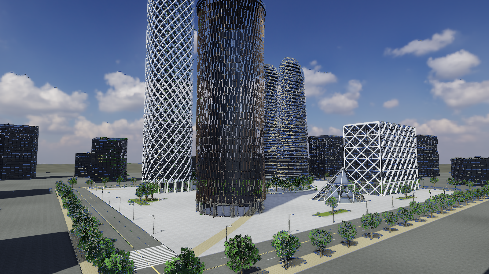

# cityblock — standalone city-block generator and renderer



A separate binary that generates one city block of the human **tech
faction** and renders it with its own PBR pipeline. It exists to find out,
outside the game's terrain/LOD machinery, what building detail and image
quality a from-scratch procedural approach can reach. Nothing here is used
by the game yet; the game can adopt pieces once they prove out.

## Build and run

The demo is part of the superbuild (`INFINITY_BUILD_DEMOS`, on by default
when the app targets build):

```
cmake -S . -B build -G Ninja
ninja -C build cityblock
demos/cityblock/tools/fetch-assets.py        # CC0 textures + skies (once)
build/demos/cityblock/cityblock
```

Without the assets the demo still runs: every material has a procedural
fallback and the sky falls back to an analytic gradient.

Controls: click to capture the mouse (Esc releases), mouse look, `W A S D`
move, `Q`/`E` down/up, Shift fast, Ctrl slow, scroll changes speed, `N`
day/night, `F1` cycles debug views (albedo, normals, ambient occlusion,
shadow cascades, roughness, direct sun, IBL diffuse, IBL specular, sun
specular), `F2`–`F5` toggle SSAO / shadows / bloom / FXAA, `+`/`-`
exposure, `R` next seed, `P` prints the camera as `--cam/--target`
arguments, `F12` screenshot.

Flags: `--seed S`, `--width W --height H`, `--sky day|night|sunset|file.hdr`,
`--sky-yaw deg`, `--night`, `--cam x,y,z --target x,y,z`, `--msaa 1|4`,
`--no-context`, `--debug N`, `--ev bias`, `--hidden --capture out.png
--frames N` for scripted captures without a visible window.

## What is generated

Everything is a pure function of the seed (Philox keys from the engine's
`core::Key` tree; `src/rng.hpp`). The block is 240 × 200 m with streets,
sidewalks, lane paint and crosswalks around it, and holds:

- a **diagrid tower** (rounded-square plan, 42 floors, white steel lattice
  over blue glass, two-storey lobby, crown lattice and lantern),
- **twin lens towers** (lens plans tapering to a point, horizontal white
  fins, sky bridge, terrazzo podium),
- a **fin tower** (dark glass cylinder with a weave of bronze vertical fins,
  cantilevered cap, louvre crown),
- an **X-frame block** (white structural diamond exoskeleton over a
  rectangular mid-rise),
- a **folded pavilion** (faceted white shell with triangulated glazing and
  internal trusses),
- a **terraced park** (stepped grass/concrete arcs, pool, benches, trees),
  tree groves, planters, paths, bollards, street lamps,
- **context towers** around the block so the sky has a skyline.

The generators live in `src/scene.cpp` on top of the geometry builders in
`src/geometry.cpp` (plans, offsets, ear clipping, extrusions, tubes,
beams, spheres, frusta). Facades are panelised per floor and module;
each panel emits recessed glass, mullions, transoms, spandrels or fins.

## Renderer

`src/renderer.cpp` and `shaders/*.wgsl`, on wgpu-native:

- three cascaded shadow maps (2048², stabilised, rotated-Poisson PCF),
- depth/normal prepass → SSAO (16 samples, depth-aware blur),
- MSAA forward PBR (GGX/Smith/Schlick, geometric specular anti-aliasing,
  sun as a disc, HDR clamp), image-based lighting from a Poly Haven HDRI
  (sun extracted and removed from the map, GGX-prefiltered specular cube,
  SH9 irradiance, all computed on the CPU at load, `src/ibl.cpp`),
- **interior-mapped glass**: rooms behind every window are ray-cast
  analytically in the fragment shader (lit/unlit per room, warm/cool light,
  blinds, distance LOD, mullion grid), reflections from the environment,
- up to 64 point lights (street lamps, night only), emissive materials,
- alpha-to-coverage foliage with canopy-space normals,
- bloom (13-tap downsample, tent upsample), ACES tonemap, FXAA,
- day/night switch with automatic exposure from the environment.

Materials are three RGBA8 texture arrays (albedo sRGB, tangent normal,
AO/roughness/height) with CPU mip chains; the sets are CC0 from ambientCG
listed in `assets/manifest.json`, fetched by `tools/fetch-assets.py`.

## Layout

```
demos/cityblock/
  CMakeLists.txt
  assets/manifest.json     CC0 asset list (textures, skies)
  tools/fetch-assets.py    downloads them into assets/{textures,sky} (git-ignored)
  shaders/*.wgsl           common, shadow, prepass, ssao, sky, main, post
  src/gpu.*                wgpu context, buffers, textures, readback
  src/renderer.*           passes and pipelines
  src/ibl.*                HDRI → sun + IBL
  src/textures.*           texture arrays, procedural fallbacks, leaf texture
  src/mesh.hpp geometry.cpp   vertex format and geometry builders
  src/scene.*              materials, the block, the buildings
  src/camera.hpp rng.hpp math.hpp main.cpp
```
